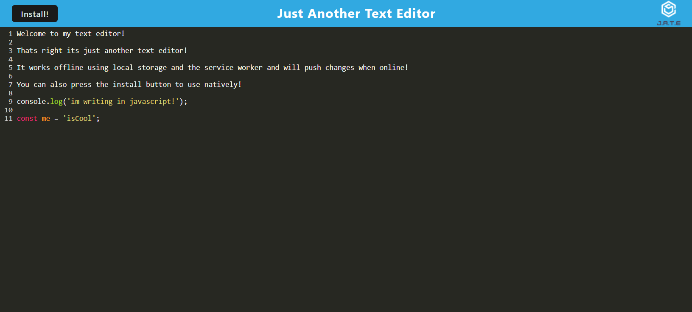

# PWA Text Editor       

## Description
Just another text editor! Using webpack and service worker you are able to use the app offline and also install it for native use on your computer. The text editor uses javascript so native javascript functions will be coloured accordingly. This project was built from base code having to fix some issues. Thank you

## Screenshots

## Usage

Just hit the link and give it a shot!
https://pwa-offline-text-editor-865ddbe23320.herokuapp.com/

## License
  Copyright 2023 

    Permission is hereby granted, free of charge, to any person obtaining a copy of this software and associated documentation files (the “Software”), to deal in the Software without restriction, including without limitation the rights to use, copy, modify, merge, publish, distribute, sublicense, and/or sell copies of the Software, and to permit persons to whom the Software is furnished to do so, subject to the following conditions:
    
    The above copyright notice and this permission notice shall be included in all copies or substantial portions of the Software.
    
    THE SOFTWARE IS PROVIDED “AS IS”, WITHOUT WARRANTY OF ANY KIND, EXPRESS OR IMPLIED, 
    INCLUDING BUT NOT LIMITED TO THE WARRANTIES OF MERCHANTABILITY, FITNESS FOR A PARTICULAR 
    PURPOSE AND NONINFRINGEMENT. IN NO EVENT SHALL THE AUTHORS OR COPYRIGHT HOLDERS BE LIABLE 
    FOR ANY CLAIM, DAMAGES OR OTHER LIABILITY, WHETHER IN AN ACTION OF CONTRACT, TORT OR OTHERWISE, 
    ARISING FROM, OUT OF OR IN CONNECTION WITH THE SOFTWARE OR THE USE OR OTHER DEALINGS IN 
    THE SOFTWARE.

## Questions
If you would like to contact me please email me at lautaro.avellaneda@gmail.com
And my github profile is https://github.com/Rockoban420